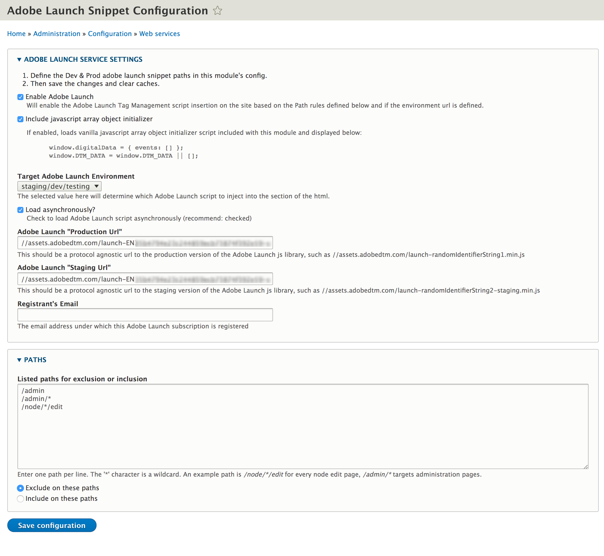

# AdobeLaunch Module

This module provides the functionality to inject the Adobe Launch javascript snippet in the <head> section of your rendered site through a backend configuration/administration page.

This module supports adding custom path rules for excluding or including the Adobe Launch snippet.

## Setup

This module can be installed as [any other Drupal 8 module]
https://www.drupal.org/docs/8/extending-drupal-8/installing-drupal-8-modules).

### Module Dependencies

The AdobeLaunch module leverages Drupal Core's built-in functions and services. There are no other dependencies.

## Documentation

### What is AdobeLaunch?

Adobe Launch is part of Adobe's Experience Platform enterprise product line and was released in March 2018 as the replacement for Adobe Dynamic Tag Manager (DTM) which is earmarked to be sunset in 2020.

[Learn more about Adobe Launch](https://www.adobe.com/experience-platform/launch.html).

### Using AdobeLaunch (for Drupal)

After installing/enabling the module, navigate to the module's configuration/administration page at:

- Admin > Configuration > Web Services > Adobe Launch Snippet Configuraton - /admin/config/services/adobe_launch/configure

From here, you can:

1. Enable/Disable Adobe Launch on your site, while still being able to configure/save the Adobe Launch snippet urls.
2. Include/Exclude the module included javascript array initializer
3. Set the Target Adobe Launch Environment
4. Set whether the Adobe Launch snippet should be loaded asynchronously (recommended setting: on)
5. Set the Adobe Launch Production URL
6. Set the Adobe Launch Staging URL
7. Note the registrant's email for the person who has registered Adobe Launch (so that they can be contacted by site admins/stakeholders).
8. List paths to exclude or include Adobe Launch snippet on (defaults to a list of known admin paths for excluding)
9. Set whether the path list is to be treated as an inclusion list or exclusion list.

